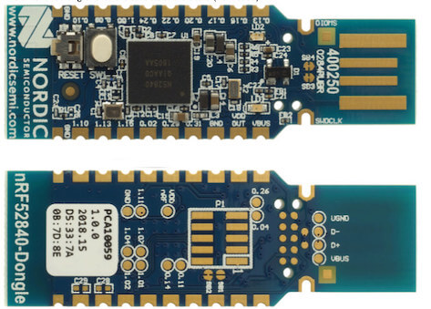

# TSDZ2 Bluetooth Bootloader

- Discussion Forum:[Fully wireless ANT+ BLE TSDZ2 mid drive motor (like Specialized Turbo Levo) -- Flexible OpenSource firmware](https://endless-sphere.com/forums/viewtopic.php?t=106346)
- Developers, see the [documentation](documentation/README.md)
- [We have also developed a wireless ebike controller for the TSDZ2 motor](https://github.com/OpenSource-EBike-firmware/TSDZ2_wireless)
as well as a [wireless remote control](https://github.com/OpenSource-EBike-firmware/ebike_wireless_remote); both use this bootloader.

-------
## Overview
This project implements a secure wireless bluetooth DFU bootloader for the TSDZ2 ebike remote control and motor controller. Once loaded on the Nordic Nrf52840 dongle, the firmware for both the remote and the wireless controller can be installed using bluetooth.

----
[Installing the Bootloader on the Nordic USB Dongle](documentation/getting_started.md)
-------
-------
[Loading New Firmware using the bootloader (the DFU Process)](documentation/dfu.md)
-----------
------------

[Technical Description](documentation/operation.md)
-----------
------------
[Security Encryption](documentation/configuration.md)
---------
---------
[Building the Bootloader](documentation/flashing.md)
------
------
[Bootloader Memory Map](documentation/memory_map.md)
-------
-------
[Important Note for Developers ](documentation/voltage_issue.md)
-------
-------
## Questions/Comments?
Please post on [this forum message](https://endless-sphere.com/forums/viewtopic.php?f=28&t=106346).