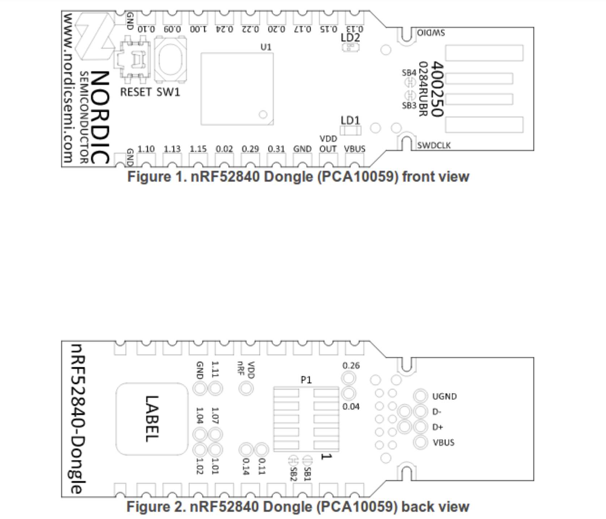

# Installing the Bootloader on the Nordic USB Dongle
**Components you will need:**
* [nRF52840 Nordic USB Dongle](https://www.digikey.com/en/products/detail/nordic-semiconductor-asa/NRF52840-DONGLE/9491124): (costs $10) this is this wireless board
*  [STLINK V2](https://www.ebay.com/c/896036216): (costs $3)
  
  ## Pinout





  
## Flashing the bootloader

* For flashing the firmware, connect the SWDCLK, SWDIO and GND pins to the STLinkV2 and follow the flashing instructions below using either Windows or Linux.
Once the firmware is flashed, the stlink  connection will not longer be required , as all future updates can be done wirelessly over bluetooth. 
````
  The firmware HEX file to flash is "TSDZ2_bootloader_with_sd.hex" 
  located in github releases. 
````
----
[Flashing Instructions for Windows](windows.md)
----
-----
[Flashing Instructions for Ubuntu](ubuntu.md)
----
----
  
## [back](../README.md)
