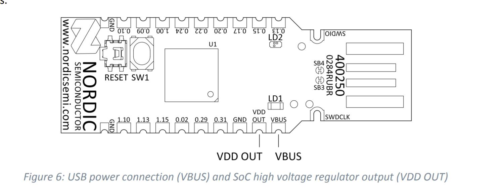
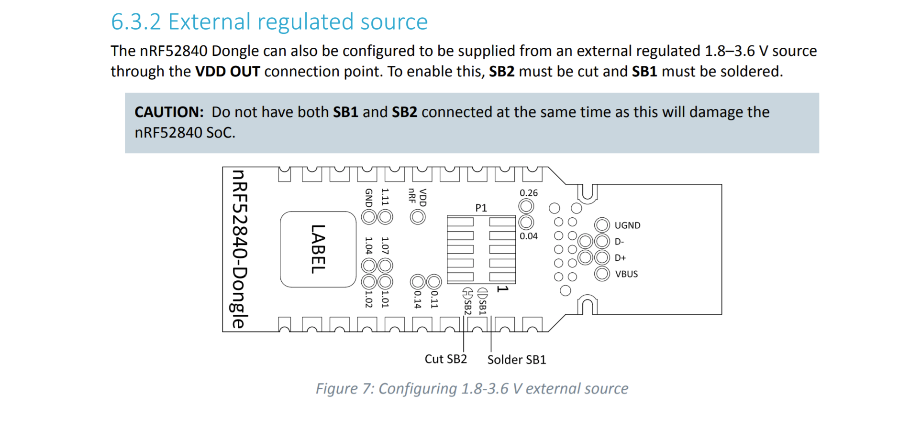

# Flash Erasure Considerations

#### Overview
 Using the OPENOCD command "mass erase" to clear flash memory will clear the UICR region and reset the voltage regulator from 3.3V to 1.8V output.  This is too low to be used with the external programmers like the ST-LINK, so erasing or programming with a firmware that does not configure the regulator for a higher VDD will leave it in a state where it cannot be re-programmed. The good news is the lower voltage only takes effect AFTER the board is reset. Therefore, to avoid this problem,be sure to flash the bootloader beeore resetting the dongle

#### Detailed explanation
 When you mass erase the chip, it clears the User Information Configuration Registers (UICR).  This includes the RegOut0 register which controls the chip’s voltage regulator output.  This was set to 3.3 V at the factory, but when it’s cleared, the default value is 1.8 V which is too low to be compatible with the ST_LINK.  Fortunately the settings don’t take effect until the chip is reset and when the TSDZ2 bootloader is flashed it will set the regulator back to 3.3 V. This is done using the BSP_BOARD_INIT function, specifically the gpio_output_voltage_setup in boards.c.
  However, if the dongle is reset , unplugged or something goes wrong before flashing the bootloader then the chip will basically be bricked and there would only be 2 recovery options. 

1. You can modify the dongle to use an external 3.3 V power supply through the VDDOUT pin.  This is accomplished by cutting the SB2 trace on the bottom of the board and soldering together SB1.

The default power supply of the nRF52840 Dongle is the 5V USB power supply (VBUS); see the [schematic for the dongle](./pca10059_schematic_and_pcb.pdf). VBUS supplies power to the on-chip high voltage regulator of the nRF52840 SoC. The output of the regulator supplies the SoC and the LEDs. VBUS is also available along the board edge.
 
 Next to VBUS, there is a connection point for VDD OUT, which is either the output of the nRF52840 SoC high voltage regulator, or the voltage INPUT for an external source like a cr2032 battery, depending on the state of the SB1 and SB2 bridges. 

2. Alternatively, you could use a debugger that supports level shifting such as the J-link EDU which has a target voltage range of 1.2 to 5 V. The J-link Mini won’t work because its minimum target voltage is 3.3 V. Another option is to use a level shifter board between the ST-LINK and the nRF52840 dongle.

## [back](../README.md)
