# Remote Control Power Analysis 
A very useful tool for determining power utilization of nrf52840 boards is the [Nordic Power Profile Kit](https://www.nordicsemi.com/Software-and-tools/Development-Tools/Power-Profiler-Kit-2)
This tool was used with the remote control to estimate the useful lifetime of a CR2032 coin battery used with the remote control.
## Setup
The remote control was powered on the VDD pin with a 3V CR3032 lithium battery following the instructions described in [Getting started -Convert the board to use an external coin battery](./getting_started.md)
## Remote Control Power modes 
The firmware for the remote control has two low power operating modes.
1. **POWER IDLE MODE** This is the default power mode of the remote when it is not processing any button commands.
The average current dissipated by the remote in this mode with Ant Lev active is 65.28uA as shown below: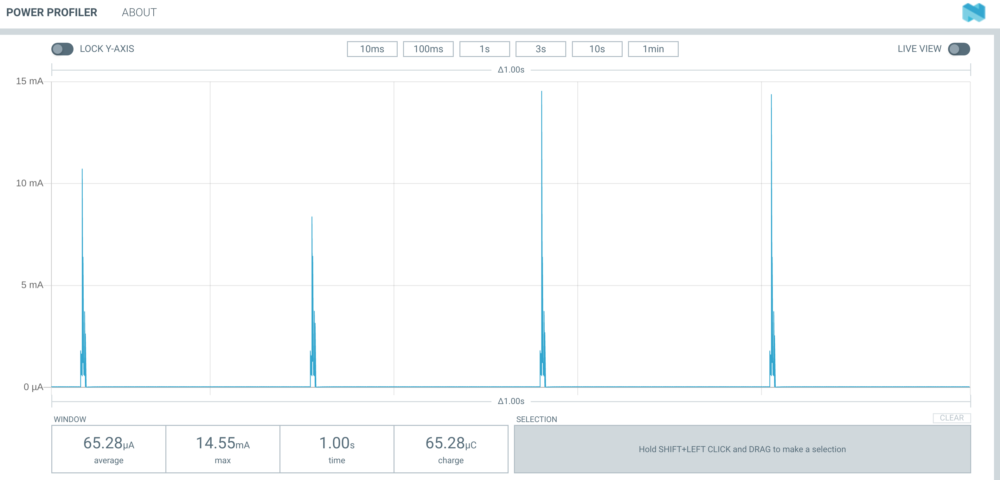
The spikes in the current is caused by the switching voltage regulator used in the nrf52840 board. Essentially, the board power supply uses capacitive charging/discharging to reduce power consumption, and this leads to spiking in the current. 
If both Ant Lev and Ant Controls is active in the remote the average idle current jumps to 88.69 uA as shown below:
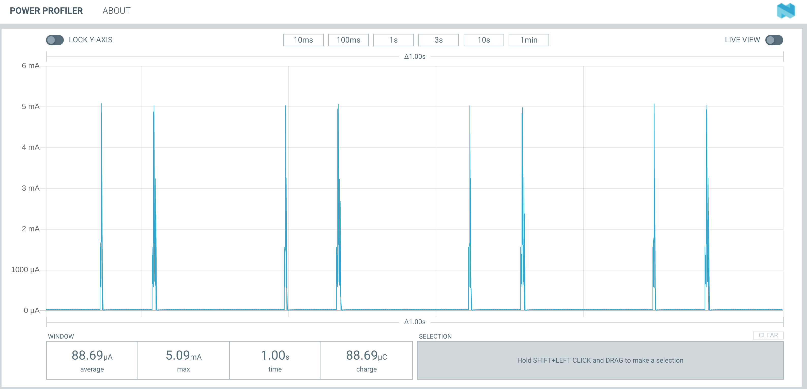
In **POWER IDLE** mode, the remote is powered on and ready to immediately process button commands.
2. **POWER OFF MODE**
   In this mode, the remote control turns off all  bluetooth and ANT wireless capabilities. The remote is put into a minimal power dissipation mode. The average power off current in this mode is only 0.44 uA as shown below:
   
3. **ANT LEV TRANSMISSION MODE**
    In this mode, either the plus or minus button is pressed to increase or decrease the assist level on the ebike.
    The average current dissipated by the the remote control when the remote control is pressed once a second is 101uA as shown below:
    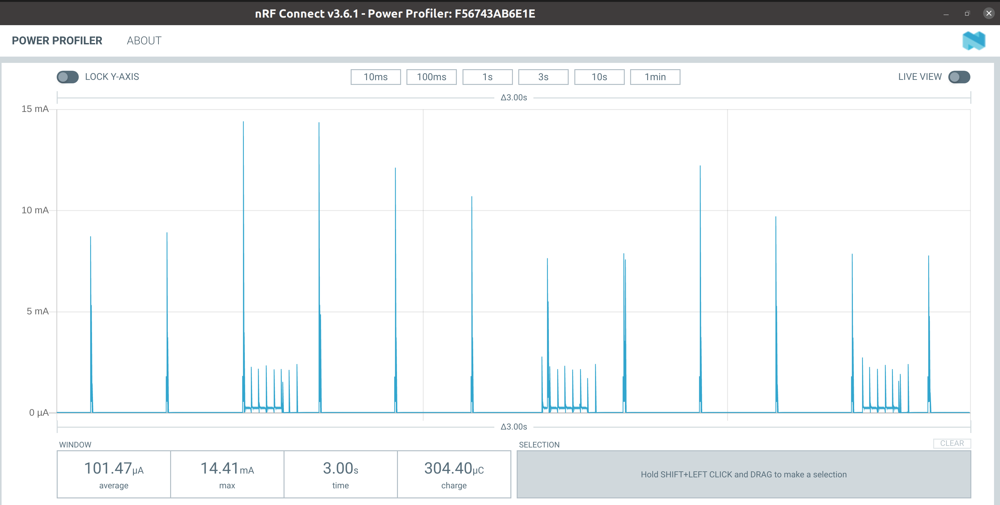
    if the button is pressed once every 2 seconds, the average current drops to 90.5uA, as shown below:
    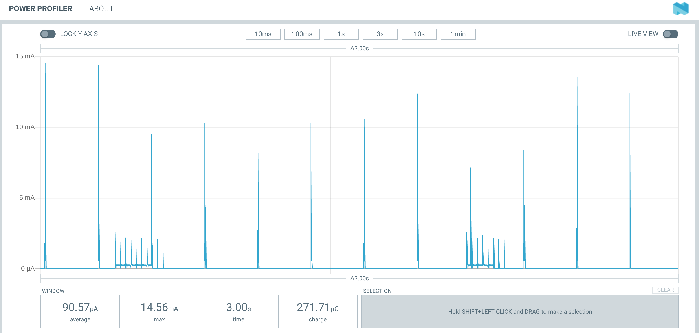
4. **ANT LEV + ANT CONTROLS TRANSMISSION MODE**
   In this mode, both Ant Lev and Ant Controls are active. The average current is 140uA when the plus button is pressed once every second as shown below:
   
   if the plus button is pressed once every 2 seconds, the average current drops to 109.2 uA, as shown below:
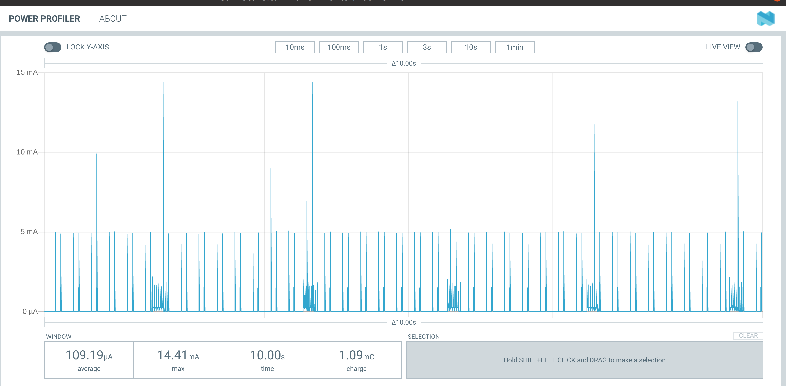
5. **ANT PAIRING MODE**
   When the board is searching for an ANT device, the average current dissipated by the board is 1 mA, as shown below:
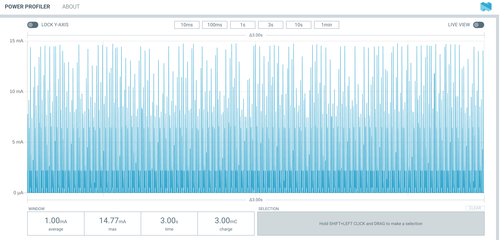
6. **BLUETOOTH PAIRING MODE**
 When the board is searching for an Bluetooth device, the average current dissipated by the board is 375.82 uA, as shown below:
 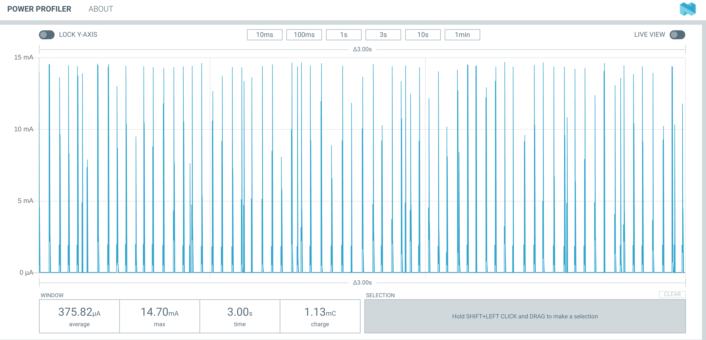
 7. **BLUETOOTH PAIRED MODE**
   In this mode the board is paired with a bluetooth device and is exchanging data. In this case, the average current is 137.2uA as shown below:
   
 8. **BLUETOOTH IDLE MODE**
   In this mode, bluetooth is connected, but no data is being exchanged. The average current is  75 uA, as shown below:
   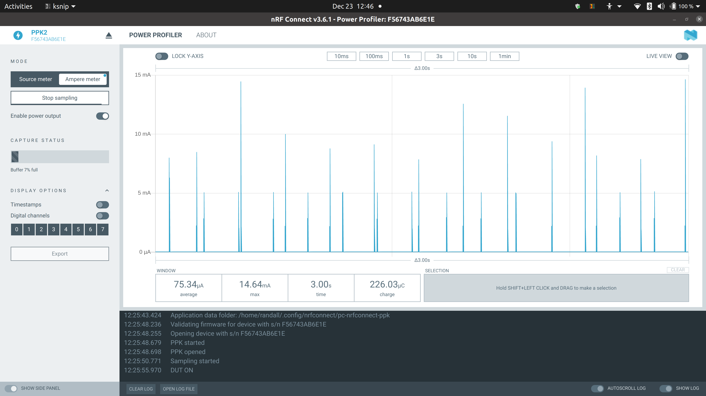
 9. **LEDS ON MODE**
   In this mode either the RED, GREEN, or BLUE LEDS are active. The average LED current when on is 4.6ma (RED), 4.0ma (GREEN) and 4.1ma (BLUE) as can be seen below when the [ENTER] button is long pressed:
   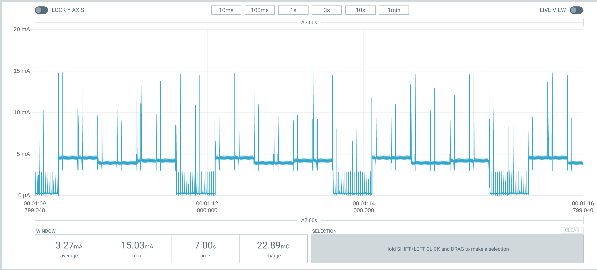
   Obviously, LED utilization should be kept to a minimum to reduce battery drain on the coin cell.

   ## CR2032 Battery life estimation
   To estimate the battery life of this battery, we use this [spreadsheet](./Battery_Life_Calculator.xls), along with some conservative assumptions:

   - The milliamp-hr (mah) energy capacity of the CR2032 battery is rated at 225mah, conservatively de-rated to 80% or 180 mah based on [an analysis done by Nordic Semiconductor on the impact that switching power supplies have on the performance of a CR2032 coin cell](./High_pulse_drain_impact_on_CR2032_coin_cell_battery_capacity.pdf) 
  The conclusion of this document is shown below:
  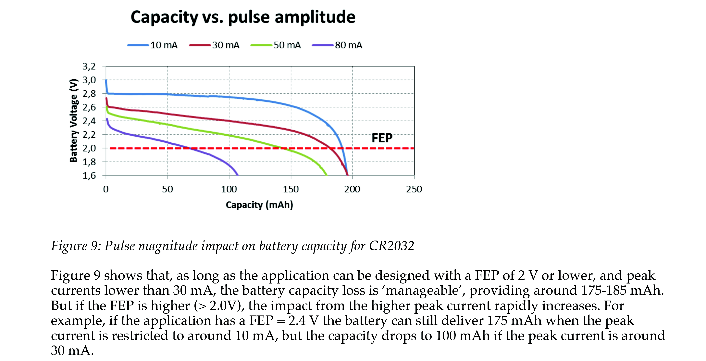
  FEP is the "Functional End Point" voltage at which the remote will no longer operate. (2 V). As can be seen from the power mode graphs above, the current peaks in the remote are between 10 and 15ma. We can therefore expect approximately 180 mah effective capacity from a CR2032 cell.
  This is the battery capacity used in the estimation of battery life.
   - The idle current is 66uA (see **POWER OFF MODE** above)
   - the **POWER OFF** current is 0.6 uA
   - The wake current is 100 uA (see **ANT LEV TRANSMISSION MODE** above)
   
   - the average duration of a button click (where the board is in transmitting mode) is 58ms as measured below:
  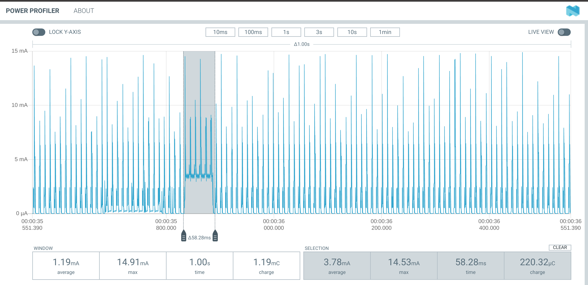
   -  The ebike is ridden 18hrs/week
   -  The remote control spends virtually no time in bluetooth mode. (bluetooth is used only when setting up the remote)
   - The Leds are used sparingly
  Feeding these assumptions into the  [Battery Life Calculator](./Battery_Life_Calculator.xls) spreadsheet, the battery life is estimated to be **29 months!**. 
  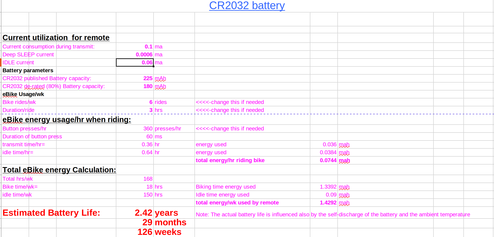
  ## Conclusion
  Based on quite conservative assumptions, it is expected that the remote will continue functioning well for at least a year. 
  **Replacing the battery annually is recommended.**
## [back](./battery.md)
 