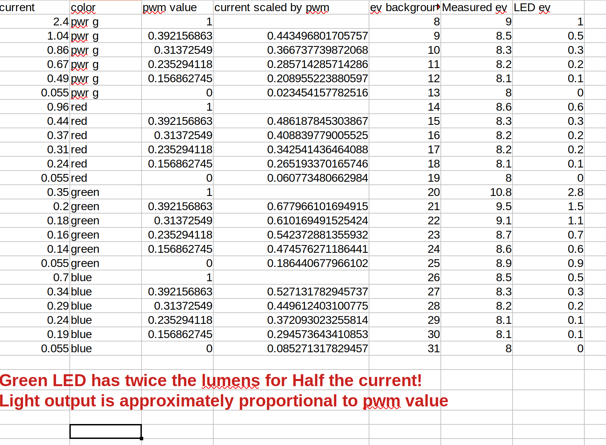

# Battery considerations
* To preserve the battery life, bluetooth should only be on when configuring the remote. If you forget to turn it off, the remote will disable bluetooth in 5 minutes
* The remote will go into ultra low power mode if it fails to connect to a device within ~30 seconds, or if no buttons are pressed for 1 hour. The system wakes up from ultra low power when the user presses any button.
* It is expected that a coin cell will be able to power the remote for one bicycle season. (6-12 months) 
* replace the battery annually. [Click here for a detailed study of the power modes of the remote and a battery life estimation](./Power_Analysis.md)
  The green is approximately approximately twice the lumen outpur of the red and blue leds for the same current! This can be seen in the following chart where the light output for the various leds was measured as a function of current and duty cycle.

  
  ## [back](../README.md)
