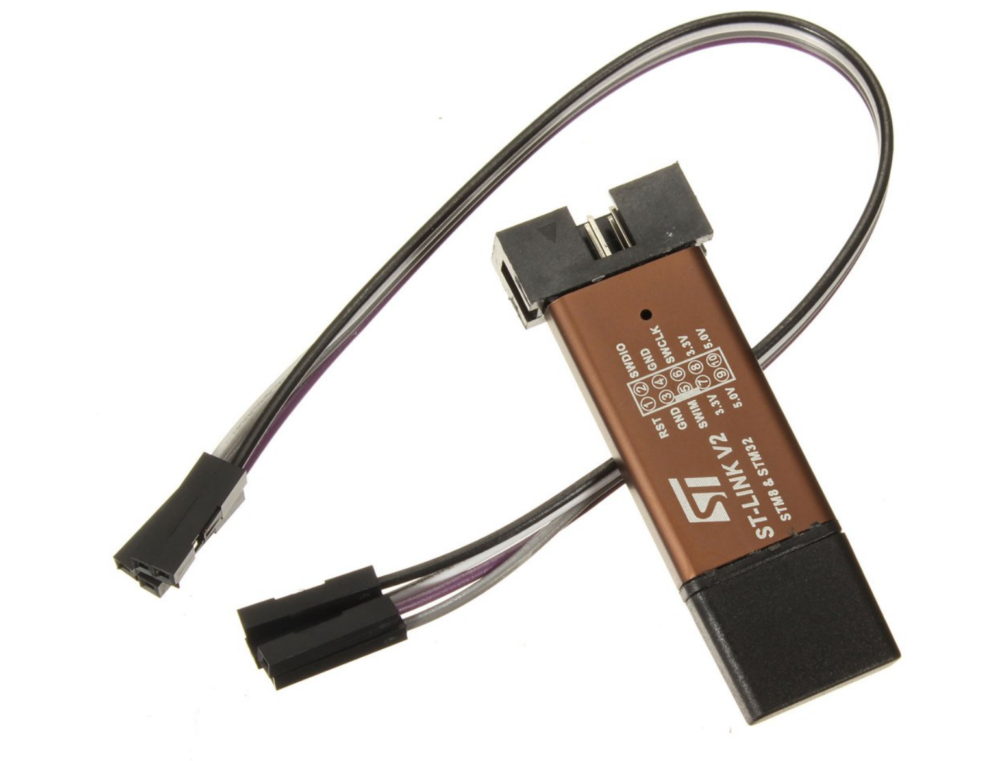
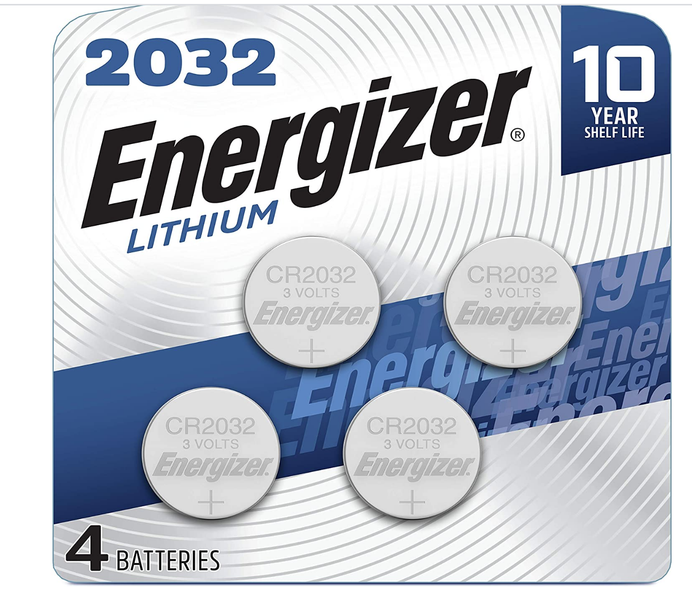
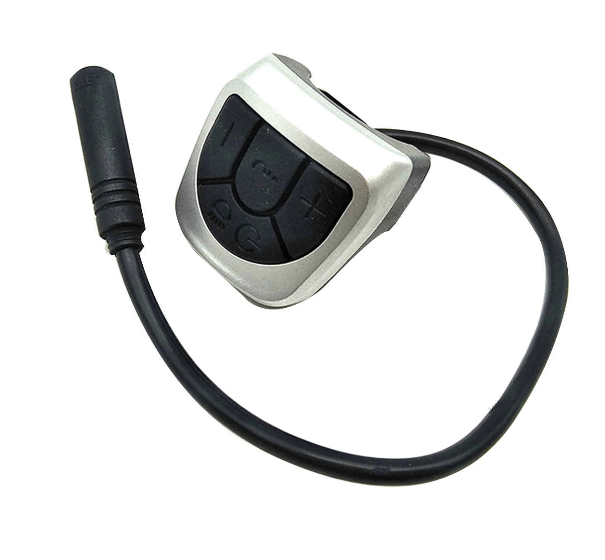
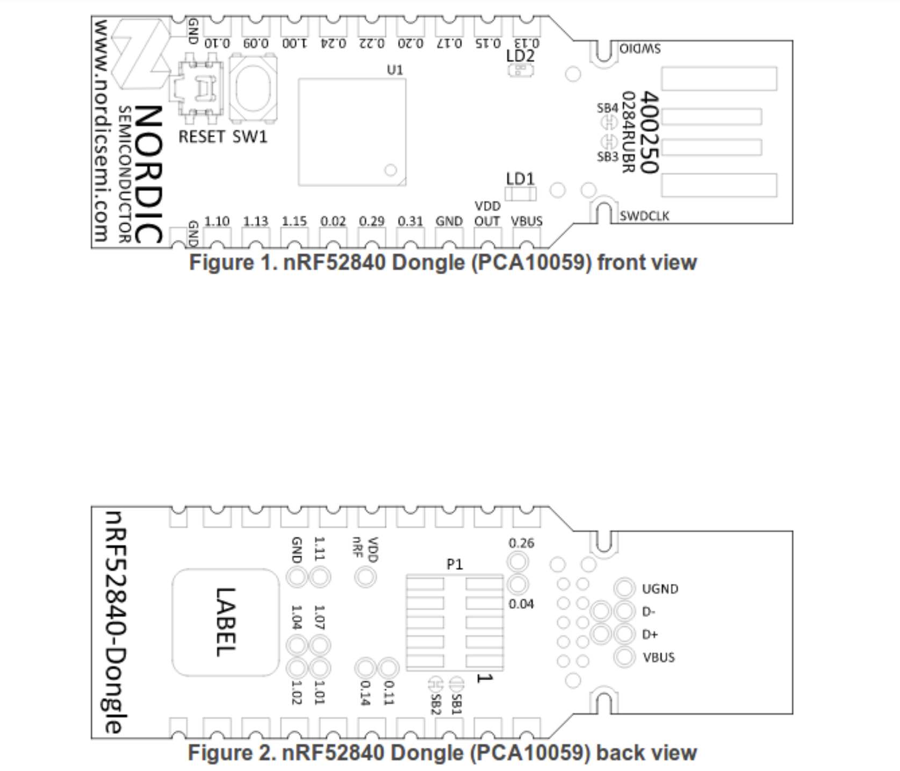
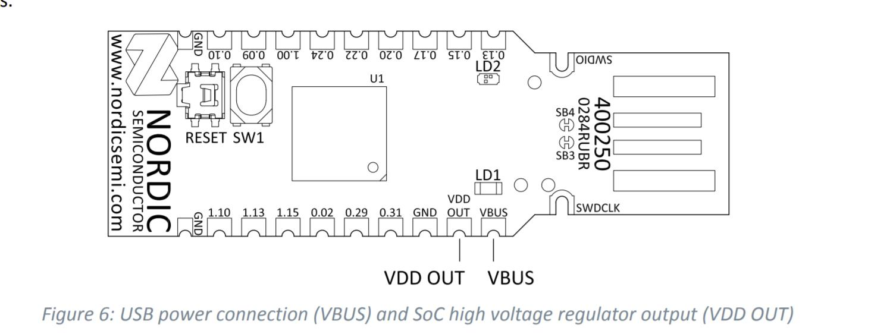
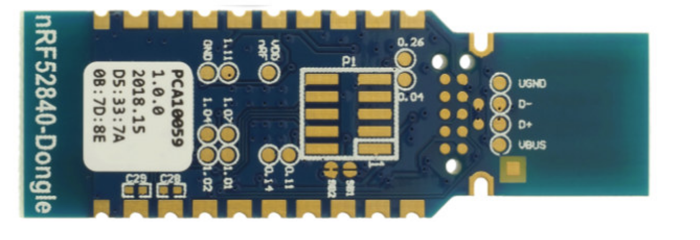

# Getting Started
**Components you will need:**
* [nRF52840 Nordic USB Dongle](https://www.digikey.com/en/products/detail/nordic-semiconductor-asa/NRF52840-DONGLE/9491124): (costs $10) this is this wireless board
* 
 

*  [STLINK V2](https://www.ebay.com/c/896036216): (costs $3)
  
*   [CRC2032 button cell](https://en.wikipedia.org/wiki/Button_cell): (costs $2)
  

* [VLCD5 handle bar remote keypad](https://www.aliexpress.com/wholesale?catId=0&initiative_id=SB_20200828081711&origin=y&SearchText=LCD+controller+of+VLCD5+display+for+TSDZ2+electric): (costs $12) can be any keypad that works in the similar way

## Board Pinout

## Schematic
(need to have a new diagram)

__Instructions:__ 

1. **Install the bootloader on the Nordic nrf52840 dongle**
   To do this, follow the "Installing the Bootloader on the Nordic USB Dongle" link in the bootloader repository located [here](https://github.com/OpenSourceEBike/TSDZ2_wireless-bootloader/blob/main/documentation/getting_started.md)
   
2. **Convert the board to use an external coin battery** 
  You can modify the dongle to use an external 3V CR2032 battery The CRC2032 button cell powers up the wireless board. Connect the cell positive to the VDD OUT pin and the negative to GND.
   

To ensure the dongle has the longest possible battery life it is necessary to cut the SB2 pad on the bottom of the board to open the circuit.

__Why do we need to cut SB2?__
Please note that the usual power supply of the nRF52840 Dongle is 5V supplied to the VBUS pin of the dongle; see the [schematic for the dongle](./pca10059_schematic_and_pcb.pdf). VBUS supplies power to a on-chip high voltage regulator of the nRF52840 SoC. The output of this regulator (3.3V) supplies the SoC and the LEDs. The cut on SB2 opens the connection to the high voltage regulator and greatly improves power dissipation when using an external battery (Power off mode dissipation improves from ~10uA to ~0.5uA - a 10X improvement. This improves the battery life from 1 to over 2 years!)
 
3. **Connect the VLCD5 keypad**
   The VLCD5 handle bar remote keypad has 4 buttons and 5 wires (1 wire for each button and 1 common wire to all buttons). Connect the wires directly to the Nordic nrf52840 dongle. The pins to connect are 0.13, 0.15, 0.17, 0.20 and GND, corresponding to **PLUS, MINUS, ENTER and STANDBY** buttons on the remote keypad
4. To flash the initial remote firmware, solder the **SWDIO, SWDCLK and GND** wires to the STLinkV2.  (Once the initial remote firmware is flashed, all future firmware updates can be done wirelessly.) Flash the firmware using the bluetooth "Device Firmware Upgrade" (DFU) process.
The bluetooth "Over The Air" (OTA) firmware zip file to flash is **TSDZ2_wireless_remote_ota_update.zip** located in github releases. 
Follow [this procedure](dfu.md) to load the wireless remote firmware on the Nordic nrf52840 dongle.
  
## [back](../README.md)
