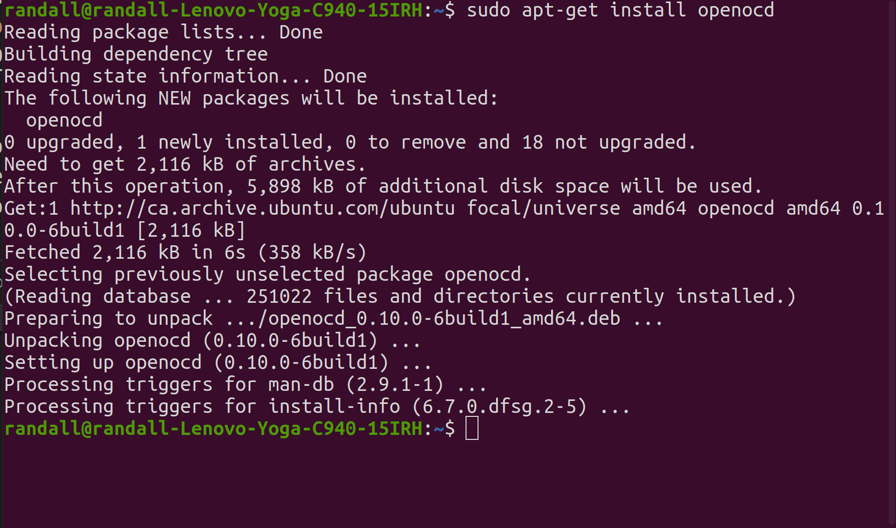
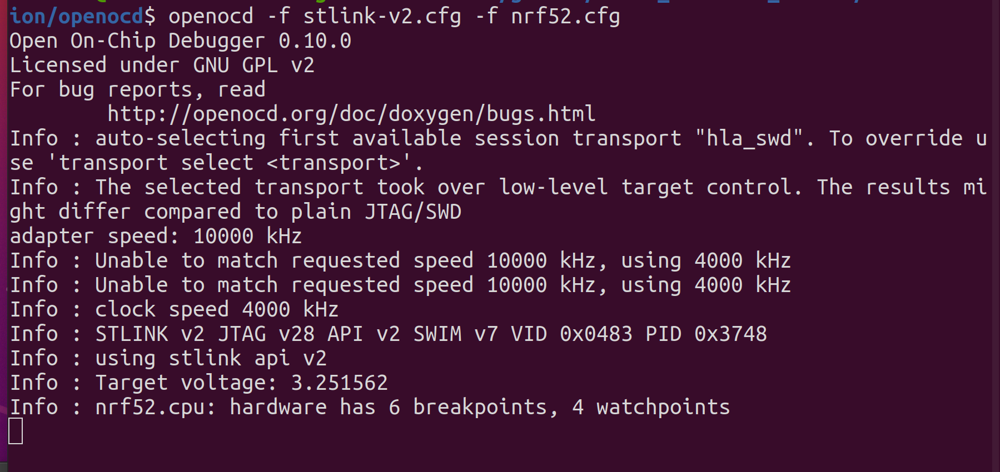
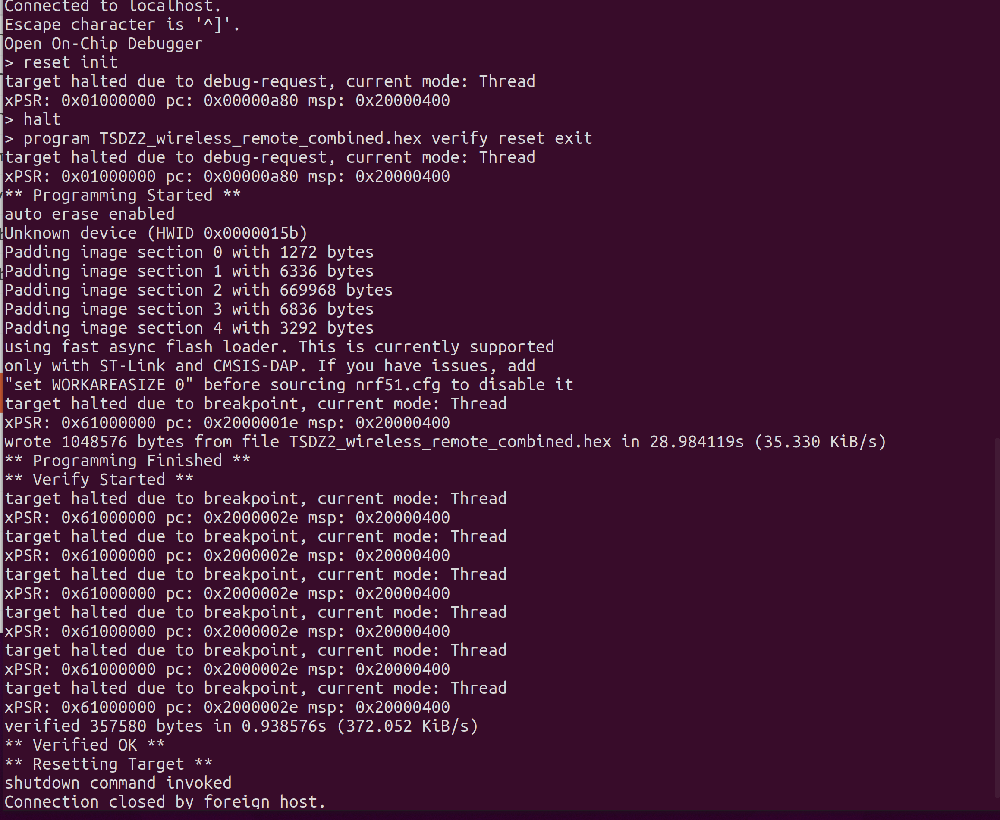

# Flashing with Ubuntu
1.    Open a terminal
2. Install OpenOCD (to connect to STLinkV2):
   
   Enter: __sudo apt-get install openocd__:

   
 
3. Connect the STLinkV2 to the board. For the  nRF52840 MDK Dongle see the pinout below to connect to the SWD pins, note that you do not need to connect the RST pin.
   
   

4. Note that you will also need to install the STLinkV2 udev rules file that are on the firmware/tools/ folder, so the STLinkV2 can be accessed by the OpenOCD:
    ```
    sudo cp 60-st_link_v2.rules /etc/udev/rules.d
    sudo udevadm control --reload-rules
    ```

5. From the terminal window, navigate to the openocd directory, and enter the following command to start the openocd server:
   
    ```
    $ openocd -f stlink-v2.cfg -f nrf52.cfg
    ```  
    

6. Start another terminal session to access the openocd server, and enter the following command:
    ```
    $ telnet localhost 4444
    $ reset init
    $ halt
    $ program (path to hex)/TSDZ2_wireless_remote_combined.hex verify reset exit   TSDZ2_wireless_remote_combined.hex 
    ```  

    

This will flash and verify the write.
If you see ** Verified OK **, the flashing has been successful.

Congratulations!
-------
You now have the board programmed.

Future firmware upgrades can be done wirelessly.
  
## [back](getting_started.md)
