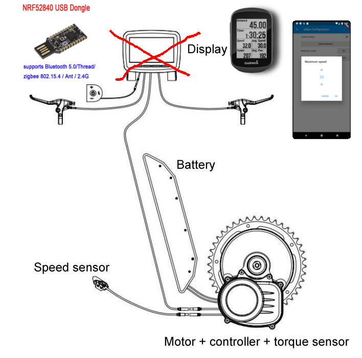
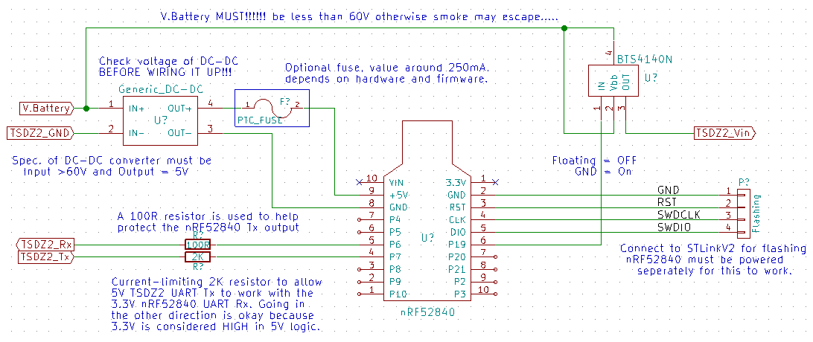
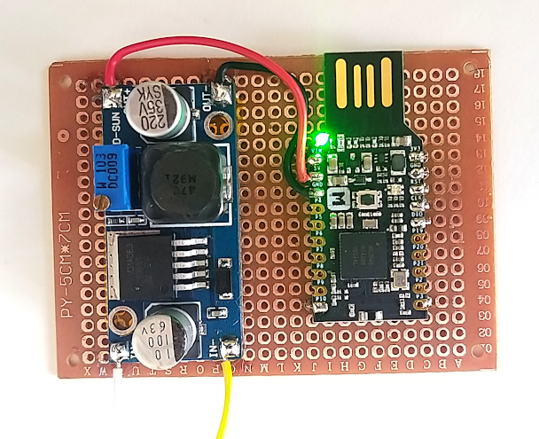

# TSDZ2 Wireless

- Forum message: [Fully wireless ANT+ BLE TSDZ2 mid drive motor (like Specialized Turbo Levo) -- Flexible OpenSource firmware](https://endless-sphere.com/forums/viewtopic.php?f=28&t=106346)
- Developers: see [documentation](documentation/README.md)

TSDZ2 Wireless project aims
------------

This project aims to make TSDZ2 mid drive motor support wireless displays and wireless remote control buttons just like the new commercial ebikes as [Specialized Turbo Levo Ebike.](https://www.youtube.com/watch?v=F43oqj1Zlww).

A very simple and cheap DIY board, that costs only 25€, will implement the wireless ANT+ LEV and Bluetooth. This board can be placed inside a small and waterproof black box, that will connect to the TSDZ2 motor display connector.

The wireless displays and wireless remote buttons are available from some different brands: there are simple ones with monochrome screen and others very advanced with GPS navigation, cycling fitness metrics and with wireless connection to cycling sensors like pedal power sensors and even tire pressure sensors. Some brands: Garmin, Wahoo, Sigma, O-synce, Specialized and Selfloops.

The LCD Display will be replaced by the DIY board, a nRF52840 Bluetooth/ANT+ module and supporting circuitry. This allows the use of wireless buttons to control the TSDZ2 motor and it acts as a bridge between the motor, an Android phone running an app, and/or an ANT+ GPS/Fitness Display. It aims to be compatible with any display that can handle the ANT+ eBike data format, displaying relevant motor data and warnings. The Android app aims to duplicate (more or less) the 850C display, working either from the touchscreen or via wireless buttons on the handlebar.

Warnings!
---------

1) Battery Voltage MUST!!!!!! be less than 60V otherwise smoke may escape.....
2) Spec. of DC-DC converter must be Input >60V and Output = 5V
3) Check output voltage of DC-DC converter BEFORE WIRING IT UP!!!

TSDZ2 cable pinout for LCD Display
----------------------------------

The nRF5280 module needs to connect to the TSDZ2 motor-controller and the easiest way to do this is by either using an old LCD cable or buying an extension cable and cutting the relevant end off. The type of cable you have/need will depend on which TSDZ2 model you ordered - there are currently two types, one with a throttle and one without. The throttle needs a 5V connection as well as an anlogue input going to the motor-controller, so it has two extra cable - eight compared to the other motor-controller's six. For this project it is advised that you do not use the throttle, so either model is fine. The pinout of the two cable types is shown above - please note that the wire colouring and pin numbers may change! Always check with a meter first.

Connecting the nRF52840 UART to the TSDZ2 STM8S105 Motor-Controller UART
-------------------------------------------------------------------------------

The TSDZ2 motor-controller's STM8S105 processor runs at 5V logic supply, whilst the nRF52840 processor runs at 3.3V. Unfortunately the nRF52 does not have 5V-tolerant GPIO inputs, so we need to be careful how we connect the two.

The nRF52 UART HIGH output (V.OH) is ~3.3V, which falls slightly out of the spec for the STM8S105 CMOS UART input, the datasheet for which states that 0.7xV.DD (3.5V) is expected for V.IH when run at 5V. However in practice it works reliably. So, as per the various 3.3V LCD displays, we can connect the nRF52 UART 3.3V output directly to the STM8S105 UART input, as shown above. For additional ESD safety we can add an optional low-value resistor to the nRF52 UART output.

Connecting the 5V STM8S105 UART output to the 3.3V nRF52 UART input is more problematic and there are [an almost infinite number of ways of doing this](https://next-hack.com/index.php/2017/09/15/how-to-interface-a-5v-output-to-a-3-3v-input/ "a random guide to interfacing 5v to 3.3v logic"). The easiest way is to rely on the [nRF52's input protection diodes](io_protection.png) to keep the input voltage below the maximum allowed.

If you just connect the two together a large amount of current will flow through the upper diode into the power supply, burning the diode out almost instantly and then destroying the input circuitry as the maximum voltage is exceeded. To avoid this, a current-limiting resistor is used as shown above. __NOTE__ - there is a trade off between small-resistor/high-current/high-speed and large-resistor/low-current/low-speed.

The absolute best way would be to use a pair of buffer/translators, [one with a TTL input running at 5V](https://www.ti.com/product/SN74AHCT1G125 "something similar to this") to drive the STM8S105 UART's input with a low-impedance output, and the other [with a CMOS input running at 3.3V](https://www.ti.com/product/SN74LVC1G34 "and something like this") to offer a high-impedance 5V-tolerant input to the STM8S105 UART's output. This offers the optimum noise resistance but at a higher cost and component count.

Connecting the nRF52840 to the STLinkV2 Programmer
--------------------------------------------------
For convenience it is advised that you permanently wire in a connector to allow programming the nRF52840, to allow for future Firmware updates - the pinout is up to you, as long as it matches the programmer's cable. Please note that the nRF5280 will need to be powered separately for the programming to be successful.

Connecting the nRF52840 to the BTS4140N High-Side Mosfet Relay
--------------------------------------------------------------
The high-side mosfet relay can be wired up directly to the nRF5280, provided the output of the nRF52850 is either floating (relay is open-circuit) or ground (relay is conducting). This can be achieved by switching the "output" pin between Output = LOW and configuring it as a High-Z Input. Alternatively look at the BTS4140N datasheet to see how a fet can be used to interface a HIGH/LOW output with the high-side relay.

Connecting power to the nRF5280
-------------------------------

A generic DC-DC converter is used to power the nRF5280's 5V input from the battery voltage. As such is should handle an input range of between 20V and 60V (check the capacitor ratings on the PCB) and provide a stable 5V supply at 1A. As mentioned above, connect it temporarily to your battery and check/adjust the output is correct before you start wiring up the nRF5280. When everything is connected up and running, it is worth checking it again and if it is adjustable, gluing the adjuster in place with a drop of nail-varnish - this has the right consistency to secure it against vibration but is easy enough to break the seal if you need to adjust it in the future. You can use a PTC fuse if you want - 250mA to 500mA is probably enough. Check it doesn't get warm/hot to the touch when in normal use - if it does, see how much voltage is being dropped across it and replace it with a larger value if it's more than 0.5Vish.

Connecting brake sensors to the TSDZ2
-------------------------------------

It is strongly advised that you connect brake sensors/switches to the TSDZ2 motor-controller as it will increase safety of operation and reduce the chance of damage to the blue gear, in some circumstances. The brake input to the TSDZ2 is pulled up to 5V by a resistor inside the motor-controller, pulling the brake input to GND indicates that the brakes are being used. This is normally done with a switch (2-Pin Connector), but if you have the 8-Way Higo cable you can use a powered brake-sensor with three wires. In both cases the sensors need to be connected in parallel to the single TSDZ2 motor-controller brake input - check that any active sensors used have an open-collector output and are designed to be connected in parallel like this. The pinout and colour of the wires is likely to change without notice, so check first. An optional diode is shown, to protect from high voltages going into brake input. Use a Schottky type to reduce the dropped voltage when it's conducting. The optional Fuse is a PTC self-resetting type to protect the TSDZ2 5V supply - 50mA should be about right, but check the spec. of your 3-wire brake sensors first.

