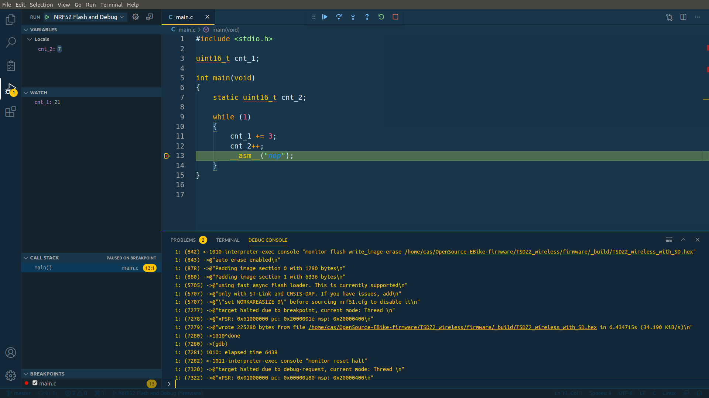

- install Code Studio
- install C/C++ extension
- install Cortex-Debug extension
- install Task Manager extension

Build code
On task manager, click on "clean" and then on "build":

Flash and debug
On task manager, click on "Launch OpenOCD":

On debug menu, click on "NRF52 Flash and Debug":

