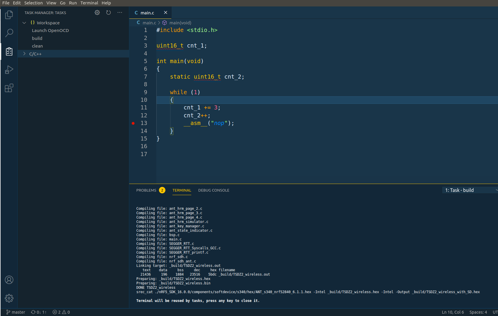

# Configure Code Studio IDE for firmware development, flash and debug

For the firmware development, flash and debug, you can use the OpenSource and free IDE [Visual Studio Code](https://code.visualstudio.com/). For sure that others will work like the Eclipse.

This guide assumes you are using Linux Ubuntu (if you are on Windows or such, the install process should be similar).

## Software to install

- install [Visual Studio Code](https://code.visualstudio.com/)
  - install C/C++ extension (to edit C/C++ source files)
  - install Cortex-Debug extension (to be able to debug ARM microcontroller)
  - install Task Manager extension (to call makefile and other commands)
- install OpenOCD (to connect to STLinkV2): __sudo apt-get install openocd__
- install GDB GNU debugger (for debug and connect to OpenOCD): __sudo apt-get install gdb-multiarch__
- install ARM C/C++ GCC compiler: __sudo apt-get install gcc-arm-none-eabi__
- install ARM binutils: __sudo apt-get install binutils-arm-none-eabi__
- install ARM newlib: __sudo apt-get install libnewlib-arm-none-eabi__

## Open project folder with Visual Studio Code

Click on menu File -> Open folder... and select the firmware directory. You should see the firmware similar to this:

## Build the code

Because you installed the Task Manager extension, you should see Task manager icon on the left bar - click on it. The build, clean and Launch OpenOCD tasks should be available.

Start by clicking on the clean to clean the code and then click on the build to build the code and you should see something similar to this - note the output on the terminal:

The clean and build tasks call the __make clean__ and __make__ on the terminal. The tasks configurations are on the file .vscode/tasks.json.

## Flash the firmware and debug

1. Connect the STLinkV2 to the board.

Note that you will also need to install the STLinkV2 udev rules file that are on the firmware/tools/ folder, so the STLinkV2 can be accessed by the OpenOCD - search on Internet for how to install udev rule file.

2. Click on the task Launch OpenOCD

You will need to click only once. The OpenOCD should connect to the microcontroller and keep active - see the example output of OpenOCD on the terminal, when a correct connection was done with the microcontroller:

The task Launch OpenOCD configuration is on the file .vscode/tasks.json.

3. Click NRF52 Flash and Debug

Click on the debug icon on the left panel and then click on the small green arrow for the NRF52 Flash and Debug - will flash the firmware on the microcontroller and then start the debug of the firmware.. Wait a few seconds and you should see something like this:

The NRF52 Flash and Debug configuration is on the file .vscode/launch.json.
